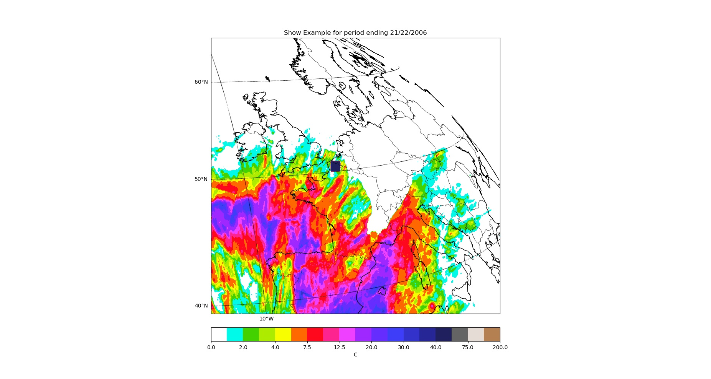
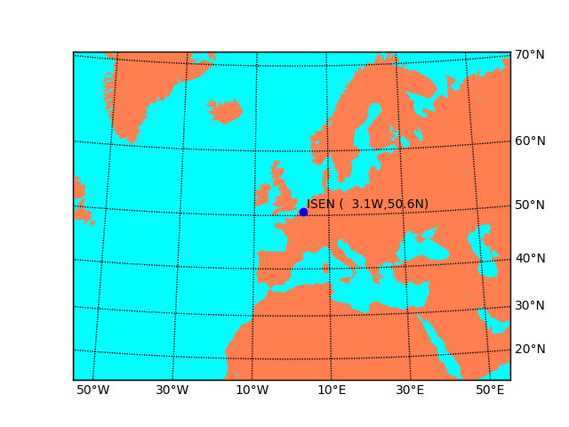

# StationMeteo
Projet IoT : Station Météo
Affichage des données sur une carte

## Utilisation
Afin de traiter les fichier .nc issue de base de données, vous devez placer dans dossier : un fichier le script python et un dossier nommé "example".
Le dossier "example" contient le fichier à traiter

Le script python créer une liste à 2 dimensions (liste de liste), chaque valeur sera ensuite affichées sur la carte.
Vous pouvez alors modifié cette liste en utilisant pas exemple des données lues sur un broker MQTT

La valeur data[i][j] sera alors affichée sur la map en ième abscisse et jème ordonnée.

## Affichage sur carte via Basemap avec script python

Basé sur : https://matplotlib.org/basemap/
Les bibliothèques Basemap et cm de mpl_toolkits doivent être installées,
tout comme netCDF4, numpy et matplotlib.

Basemap : Outil de matplotlib permettant de tracer les maps
netCDF4 : Bibliothèque permettant l'ouverture des fichiers récupérer sur water.weather.gov

Fonctionne sur python 2.7, testé sous Ubuntu 16.04

Matplotlib met à disposition un fichier (sur le lien précédent) rendant le programme compatible avec les version python 3.x

## Exemples de données affichées

Traitement du fichier file.nc et ajout de quelques données simulant une lecture MQTT

Il est possible de positionner des repères sur les cartes affichées.

## Ouverture

L'affichage des données prends plusieurs secondes, on ne peut donc pas afficher de données en temps réel, mais le système reste compatible avec les stations météo envoyant une données toutes les 15 minutes
On pourrait créé un programme récupérant les images générées à l'aide d'un ensemble de données pour créer des cartes animées.
